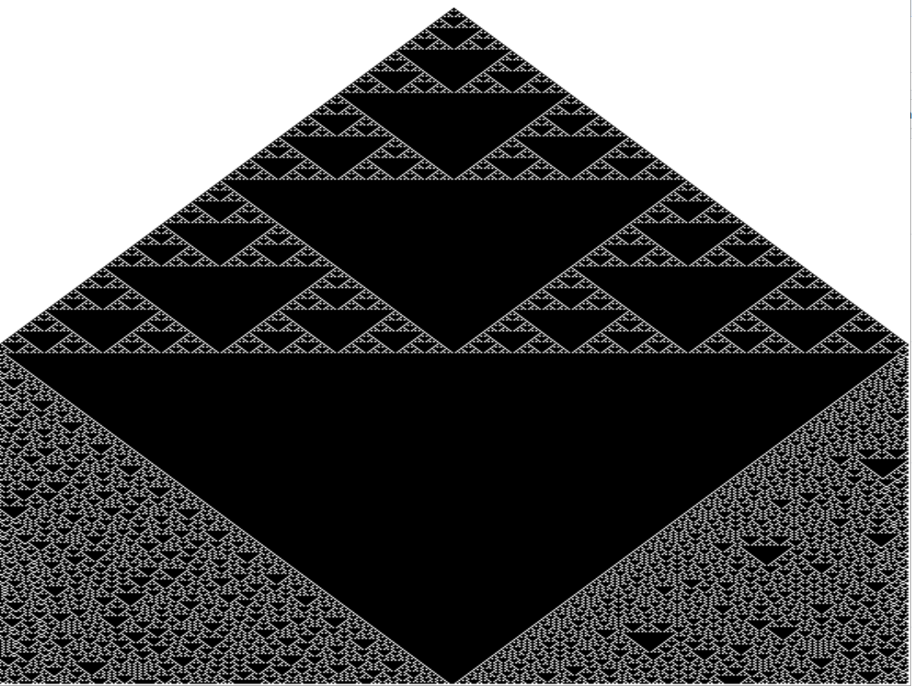

# Cellular-Automata
c++ Elementary Cellular Automata Generator

## Running the Cellular-Automata program:

in VS compile and run;

# Examples:

Rule 20:

[]

# USE

 -'z' to add a random orbiter
 -'x' to add a perfect orbiter around biggest star
 -'e' clear all orbiters
