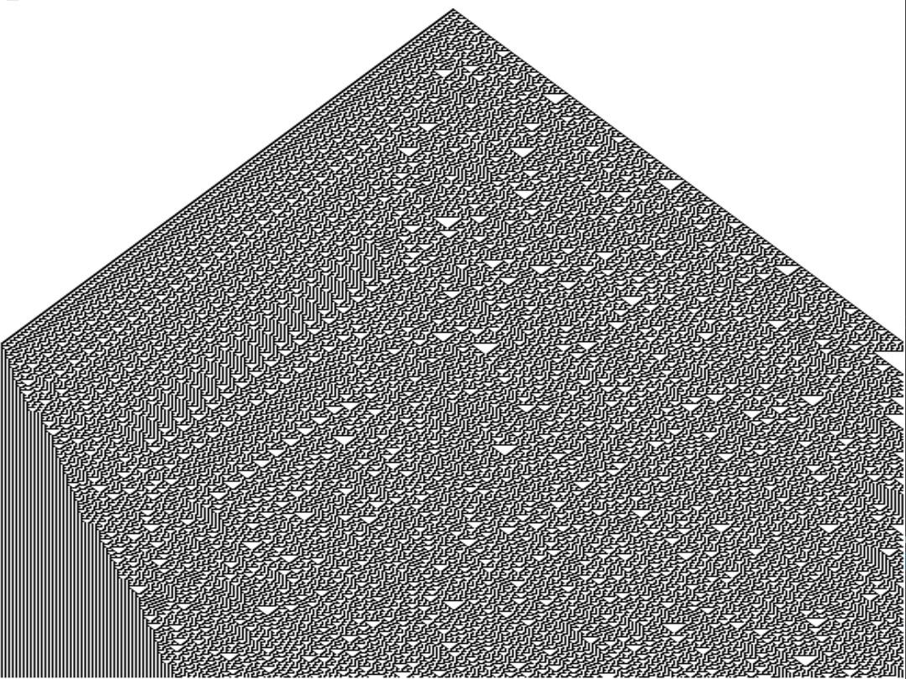

# Cellular-Automata
c++ Elementary Cellular Automata Generator

## Running the Cellular-Automata program:

in VS compile and run;

# Examples:

Rule 20:

[]

Rule 30:
[]

# USE
in the main program, tweak int cond[8] = { 1, 0, 1, 1, 0, 1, 1, 0 }; to generate new cellular structs.
